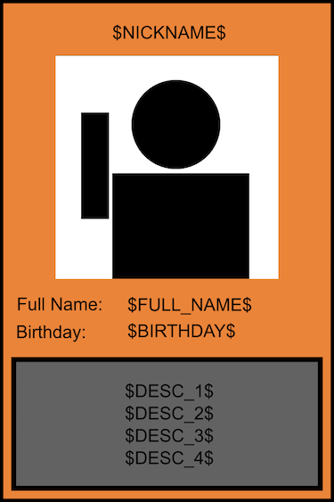
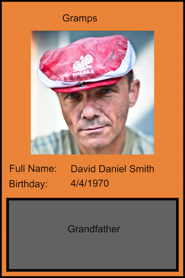

# Family Flashcards

This is a flashcard generator for helping remember large groups of people.

This was designed to help memorize the members of a real-world family. The [output images](output/smiths/png) are meant to be printed (at home or by a custom card printer) and used to help associate faces with names and other personal details.

I've [hidden](.gitignore) files with personally identifying information and added example files (the 'Smith' family) to better illustrate usage.

## Inputs
A [CSV file](input/data/smiths_example.csv) lists personal details for each family member: names, nicknames, birthdays, etc. One row per family member.

```
Name,Nickname,Relationship (to John Smith),Birthday,Image
David Daniel Smith,Gramps,Grandfather,4/4/1970,Grampa_Dave_cropped.png
...
```

An [SVG template](input/templates) provides a layout for images and text:



A square photo of each family member:


## Output

Two images are generated for each family member: a card front, with all details listed, and a card back, with just the person's image.

Card Front:



Card Back: 


## Implementation
The main script is written in JavaScript, uses minimist to parse arguments and calls [Inkscape](https://inkscape.org/en/doc/inkscape-man.html) to convert SVGs to PNG. SVG field substitution is done by copying SVGs and replacing text.